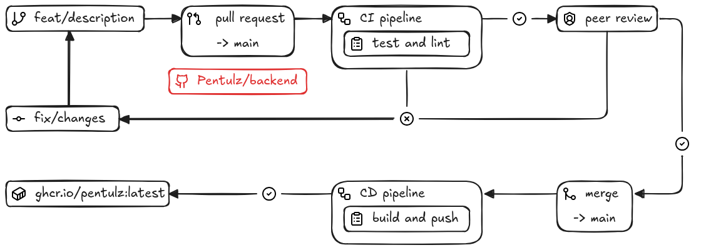

# Pentulz Backend - Deployment Guide

> **Description**: CI/CD workflows, image publishing, and deployment instructions.

**Maintainer**: Pentulz Team · **Last updated**: 2025-09-05

## 1. Overview

This project uses **GitHub Actions** and **GitHub Container Registry (GHCR)** for deployment.  
Images are built automatically and pushed to `ghcr.io/pentulz/backend`.

## 2. Workflows

- **CI (all branches/PRs)**  
  Runs tests and linting on every push and pull request.  
  Ensures the code is correct before merging.

- **CD Production (tags)**  
  When a Git tag is created (e.g. `v1.0.0`), a production image is pushed:
  - `ghcr.io/pentulz/backend:v1.0.0`
  - `ghcr.io/pentulz/backend:latest`

Here is an illustration of the workflows:



## 3. How to Release

1. Make sure all tests/lint checks pass on your branch.
2. Merge into `main`.
3. Create a Git tag:

   ```bash
   git tag v1.0.0
   git push origin v1.0.0
   ```

## 4. Docker Compose Deployment

This repository provides a `docker-compose.yml` with two profiles:

### Development Mode

```bash
docker compose --profile dev up --build
```

- Mounts local code (`.:/app`)
- Enables `--reload` for fast development
- Auto-initializes database schema

### Production Mode

> [!NOTE]
> Production deployment is handled in the [official Pentulz repository](https://github.com/Pentulz/Pentulz). This backend repository is for development and testing only.


## 5. Environment Variables

Create a `.env` file in the project root:

### Development Configuration

```env
APP_NAME=Pentulz Backend
APP_ENVIRONMENT=dev
APP_DEBUG=true
APP_CORS_ALLOW_ORIGINS='["http://localhost:3000","http://localhost"]'

APP_DATABASE_HOST=database
APP_DATABASE_PORT=5432
APP_DATABASE_USER=postgres
APP_DATABASE_PASSWORD=postgres
APP_DATABASE_NAME=pentulz
```


## 6. OpenAPI Documentation

Once the container is running:

- **Swagger UI**: [http://localhost:8000/docs](http://localhost:8000/docs)
- **ReDoc**: [http://localhost:8000/redoc](http://localhost:8000/redoc)

## 7. Dependency Management (Why Poetry & requirements.txt ?)

- **Poetry** is used for local development and CI:
  - Dependency management (`pyproject.toml`)
  - Dev tools (`pytest`, `pylint`, etc.)
  - Virtual environments

- **requirements.txt** is used only inside Docker images:
  - Faster builds (simple `pip install -r requirements.txt`)
  - No need to install Poetry in production

To export dependencies for Docker:

```bash
poetry export --only main --without-hashes -f requirements.txt -o requirements.txt
```

This keeps local development powerful with Poetry, while production images stay lightweight and fast.

---

Built with ❤️ by the Pentulz team. If you need help or find an issue, please open an issue in the repository.
